# PHANTOM

## About
### Source code for **PHANTOM ServerSide** GUI

PHANTOM was a server-side made back in 2018 *(Formally known as "BRUHK3K" at the time)*.  
It has since been discontinued, and I decided to release the source code to the GUI.  
Sometime in 2024 I began updating PHANTOM's GUI more regularly, and it's now become a sort of passion project.
#### Update *(May 25th, 2025)*:
There will be no further updates after Version 1.9.2

#### Notice
Older version of PHANTOM may contain bugs that hinder the user experience. Please consider using the [Newest Version](./PHANTOM.rbxm).

## License
### This project is licensed under the GNU General Public License v2.0
See the [LICENSE](./LICENSE.txt) file for details.

---

# Pages and Features List
## Executor:
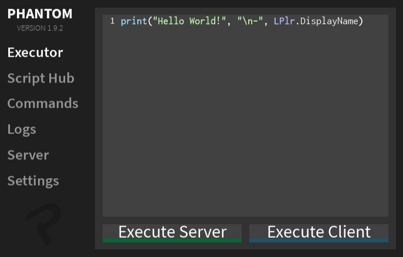
- Code Execution
  - `Client Sided`, `Server Sided`
- Local Player Variable
  - Quickly Reference the `Local Player` by Using the Variable `LPlr`
- Syntax Coloring
- Line Counting

## Script Hub:
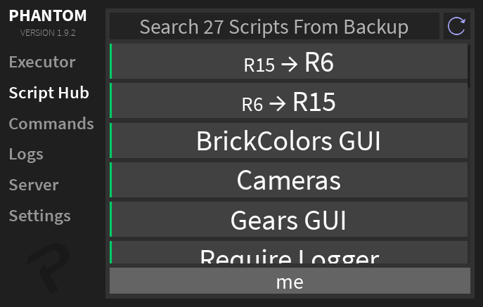
- Built-In Backup Script List if Download of Pastebin Failed
  - Refresh Option Provided to Try Again
- Version Tracking
- Multiple Script Groups with Custom Colors
  - Differentiate Danger Levels
- Warnings for Executing on Multiple Players
  - Executing on Multiple Players
  - Executing Scripts Marked as Dangerous
- Auto Convert Tags
  - `R6`, `R15`
  - Auto Converts Target on Script Execution if Necessary
- Target Player Variable
  - Quickly Reference the `Target Player` by Using the Variable `LPlr` inside the Script String

## Commands:
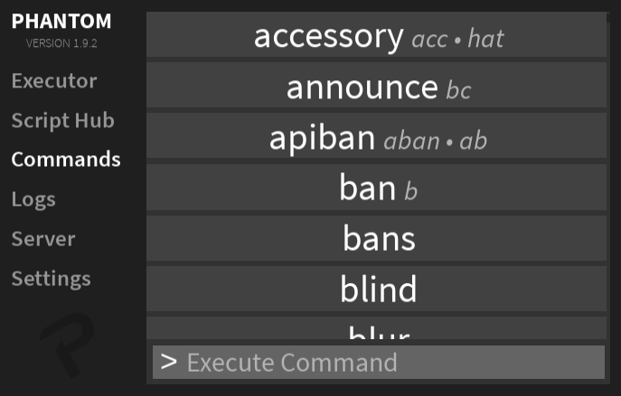
- 170 Built-In Commands
- Command Aliases
- Optional Command Arugments
- Advanced Player Targeting
  - Special Targets: `me`, `all`, `others`, `random`, `!viewing`, `!targets`, `!distance`, `#team`
  - Target Exclusion: `-playerName`, `-me`, `-others`, `-random`, `-!viewing`, `-!targets`, `-!distance`, `#team`
- Command History
  - Use the `Up` and `Down` Arrow Keys to Navigate the Command History

## Command Bar:
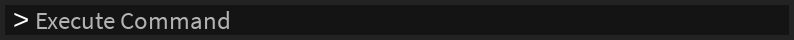
- Quickly Execute Scripts by Pulling Up the Command Bar
  - Default Keybind: `;`
- Command List

## Logs:
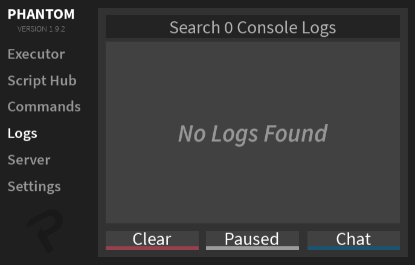
- Console Logs
  - `Client`, `Server`
  - `Outputs`, `Warnings`, `Errors`
- Chat Logs
  - `Auto Translation` to English via `Google Translation API`
  - `Display Names` or `Normal Names` Can be Used by Deafult *(Editable in Settings)*
  - `Custom Colors` or `Team Colors` Can be Used by Deafult *(Editable in Settings)*
- Type Searching for Console Logs
  - `type:server`, `type:client`, `type:error`, `type:warning`, `type:output`
  - `type:type searchString`
- Special Highlighting for Required Asset Logs
- Log History Restoration
  - `Right Click` the `Pause Button`
- Chat Log Quick Actions
  - `Left Click` a Log to Switch the Player's Name Between their `Display Name` and `Normal Name`
  - `Right Click` a Log to `Delete` it

## Server:
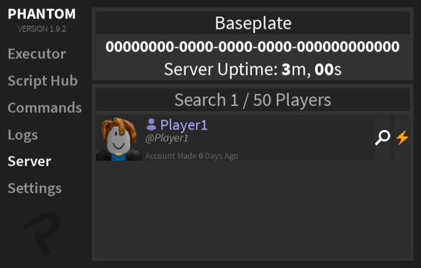
- Player List
  - `Badges`, `Picture`, `Name`, `Display Name`, `User ID`, `Account Age`
- Server Info Display
  - `Name`, `Job ID`, `Uptime`
- Player Shortcuts
  - `Actions`, `Scan`, `Script Hub`

## Actions:
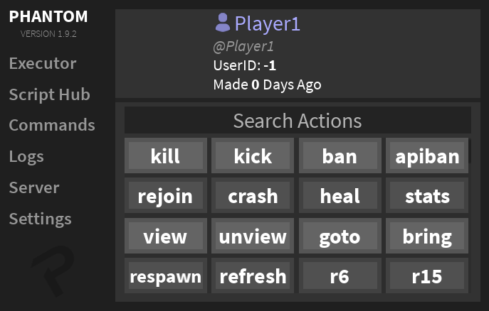
- Player Info Display
  - `Badges`, `Picture`, `Name`, `Display Name`, `User ID`, `Account Age`
- Quick Command Actions
  - Tap on an `Action` to `Execute` it

## Scan:
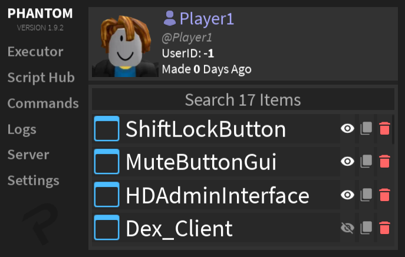
- Player Info Display
  - `Badges`, `Picture`, `Name`, `Display Name`, `User ID`, `Account Age`
- PlayerGUI Display
- Quick Item Actions
  - `Delete`, `Copy`, `Toggle`
- Copy All *(If Unique Item in List)*
- Local PlayerGui Support
  - Viewing Items that are Client Sided Only
  - Only Supported with the Local Player *(Not Other Players)*

##  Settings:
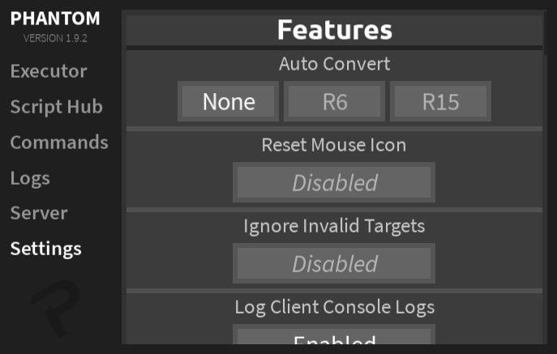
- Features Section:
  - Auto Convert
  - Reset Mouse Icon
  - Ignore Invalid Targets
  - Log Client Console Logs
  - Command History
- Chat Logs
  - Translate
  - Translation Format
  - Use Display Names
  - Use Team Colors
- ESP
  - Toggle
  - Highlight
  - Display Titles
  - Use Team Colors
- Notifications
  - Toggle
  - Extra Command Notifications
  - Print to Console
  - Max Notifications
- Keybinds
  - High Priority Keybinds
  - Minimize
  - Command Bar
  - Inspect
  - ESP
- Closing
  - Close GUI
  - Hide GUI *(Hide the PHANTOM GUI for a Specified Amount of Time)*

## Inspect:
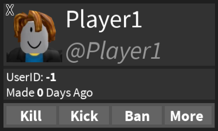
- Inspect a Player to View Info About Them or Perform Actions
  - Hover the `Mouse` Over the Player's `Character`
  - Default Keybind: `F8`
- Player Info Display
  - `Badges`, `Picture`, `Name`, `Display Name`, `User ID`, `Account Age`
- Quick Actions
  - `Kill`, `Kick`, `Ban`, `More`
  - `More` will Open the `Actions` Page for the Following Player

## ESP:
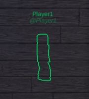
- Quickly See the Locaiton of Everyone in the Server
  - Default Keybind: `F6`
- Highlight Can be Enabled for Greater Visibility
- Name Titles Can be Toggled
- Custom Colors or Team Colors Can be Used

## Notifications:
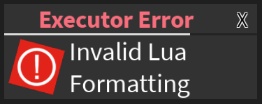
- Executor
  - Formatting Errors
  - Lua Errors
- Script Hub
  - Successfull Executions
  - Target Errors
  - Auto Conversion Errors
- Commands
  - Successes
  - Errors
- Logs
  - Required Asset Logged
  - Log Restoration
- Server
  - Owner Joined
  - Owner Left
  - Owner's Friend Joined
  - Owner's Friend Left
  - Player Hidden
  - Player Unhidden
- Settings
  - Invalid Hide Time

## Player Badges:
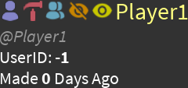
- These Badges Can be Displayed in the Server, Actions, Scan, and Inspect Pages
- Purple: Local Player
- Red: Game Developer/Owner
- Blue: Game Developer/Owner Friend
- Orange: Hidden
- Yellow: Unhidden *(Was Previously Hidden)*

---

# Changelog

## [Version 1.9.2 (Latest)](https://github.com/FlowScript/PHANTOM/commit/bda3c5f959080fa560ea6b8e47b5d6b160775236)

**New Commands:**
- `Accessory`, `UnAccessory`
- `MeshAccessory`, `UnMeshAccessory`
- `Mesh`, `UnMesh`
- `Blur`, `UnBlur`
- `ColorCorrection`, `UnColorCorrection`
- `LocalBlur`, `UnLocalBlur`
- `LocalColorCorrection`, `UnLocalColorCorrection`
- `ScreenShake`, `UnScreenShake`
- `Face`, `UnFace`
- `Shirt`, `Pants`

**New Features:**
- Added `Target Exclusion` with `-`
  - Example: `kill all,-player2` - This will kill `All` players besides `Player2`
- Added `Refresh` button to `Script Hub`
- `Distance Tag` now uses `Viewing` Player if a Player is being `Viewed`
- You can now view your `Local GUIs` by `Scanning the Local Player`
- `Scan` Page now tracks Items' `Names` and will Update them
- Added `Type Searching` to Scan Page
  - Example: `type:script ScriptName`, `type:script,screengui`
- Added `High Priority Keybinds` Setting
  - When enabled, Phantom will use `ContextActionService` instead of `UserInputService` to handle Keybinds
- `Logs` page will now display the `Current Number` of Console Logs and Chat Logs
- Improved `All` Search Functions
  - `Position Saving` and `Multi Searching`
  - Multi Search Example: `search1,search2,etc...`
- Added support for more `Strings` and `Comments` in Executor Syntax
  - `[[ ]]`, `[=[ ]=]`, `--[[ ]]`, `--[=[ ]=]`
- Added `Notifications` for `Log Restore`

**New Optional Arguments for Commands:**
- `Player(s)` to `CopyTools` command
- `ToolName` to `StarterGear`, `RemoveStarterGear`, `UnGear`, `CopyTools` commands
- `Droppable` and `StarterGear` to all *Gear Type* commands
- `AutoAssignable` to `CreateTeam` and `RenameTeam` commands
- `DoubleSided` to `Decal` and `Sign` commands
- `BlastPressure` and `BrickColorIndex`*2* to `Explode` command
- `MaxDistance` to `MusicCharacter` and `MusicPart` commands
- `CelestialBodies` to `Skybox` command
- `Opacity` to `Smoke` command
- `ForceFieldDuration` to `SpawnPoint` command

**Removed:**
- `CopyToolsTo`, `PreviousError`, `PrivousSuccess` commands
- `Hide Require Logs on Execute` setting *(Now Enabled by Default)*

**Changes:**
- Every other row in the `Actions` Page has a different `Background Color` for better visibility
- `Command History` is now synced between `Commands page` and `Command bar`
- Slightly Changed the Look of the `Other Pages`
- Changed how the `Name` script functions
- Tweaks and Changes to `GUI` and `Backend`

**Bug Fixes**

### See the [CHANGELOG](./CHANGELOG.md) file for the full changelog.